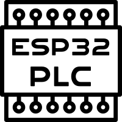

<a name="readme-top"></a>
<!-- PROJECT LOGO -->
<br />
<div align="center">
  <a href="https://github.com/hiperiondev/ESP32-PLC">
    
  </a>

<h3 align="center">ESP32-PLC</h3>

  <p align="center">
    ESP32 PLC for ladder logic programming
    <br />   
  </p>
</div>

<!-- ABOUT THE PROJECT -->
## About The Project
  
**ESP32-PLC** is an open-source project that enables the ESP32 microcontroller to function as a Programmable Logic Controller (PLC) using ladder logic programming. Built with the Espressif IoT Development Framework (ESP-IDF), it leverages the [ladderlib](https://github.com/hiperiondev/ladderlib) C library to execute ladder logic programs and likely integrates with the [ladder-editor](https://github.com/hiperiondev/ladder-editor) web application for designing control logic. This project is currently under active development, offering a cost-effective solution for industrial automation, educational purposes, and hobbyist projects.  
  
## Table of Contents  
  
- [Introduction](#introduction)  
- [Features](#features)  
- [System Architecture](#system-architecture)  
- [Hardware Requirements](#hardware-requirements)  
- [Software Requirements](#software-requirements)  
- [Installation](#installation)  
- [Usage](#usage)  
- [Example Applications](#example-applications)  
- [Troubleshooting](#troubleshooting)  
- [Contributing](#contributing)  
- [License](#license)  
  
## Introduction  
  
The ESP32-PLC project, developed by hiperiondev, aims to transform the ESP32 microcontroller into a Programmable Logic Controller (PLC) for industrial automation and control systems. PLCs are specialized devices used to control machinery and processes through programmed logic, commonly using ladder logic, a graphical programming language defined by the IEC 61131-3 standard. Unlike traditional PLCs, which can be expensive, this project leverages the low-cost, feature-rich ESP32, known for its dual-core processor, Wi-Fi, and Bluetooth capabilities, to provide an accessible alternative.  
  
The project uses the Espressif IoT Development Framework (ESP-IDF), a low-level development environment that offers greater control over the ESP32 hardware compared to Arduino-based solutions. It likely integrates the [ladderlib](https://github.com/hiperiondev/ladderlib) C library for executing ladder logic programs and may work with the [ladder-editor](https://github.com/hiperiondev/ladder-editor), a web-based tool for creating and simulating ladder logic diagrams. As a work-in-progress, the project may lack comprehensive documentation, but it holds promise for applications in industrial automation, education, and IoT.  
  
## Features  
  
The following features are inferred based on the project’s context and related repositories:  
  
- **Ladder Logic Programming:** Supports ladder logic, a graphical language resembling electrical relay circuits, using the [ladderlib](https://github.com/hiperiondev/ladderlib) library.  
- **ESP-IDF Framework:** Built with ESP-IDF for low-level control and optimization on the ESP32.  
- **Hardware Interaction:** Interfaces with ESP32 GPIO pins for reading inputs (e.g., sensors) and controlling outputs (e.g., relays).  
- **Web-Based Editor Support:** Likely compatible with the [ladder-editor](https://github.com/hiperiondev/ladder-editor) for designing and simulating ladder logic diagrams.  
- **Potential IoT Integration:** May leverage ESP32’s Wi-Fi and Bluetooth for remote monitoring or control (speculative, pending project updates).  
- **Open-Source:** Freely accessible codebase, encouraging community contributions.  
  
*Note:* As the project is under development, the feature set may evolve. Check the [GitHub repository](https://github.com/hiperiondev/ESP32-PLC) for updates.  
  
## System Architecture  
  
The ESP32-PLC project likely employs a modular architecture:  
  
1. **Ladder Logic Editor:**  
- Users create ladder logic diagrams using a tool like the [ladder-editor](https://github.com/hiperiondev/ladder-editor), a web-based application that supports real-time communication via WebSockets.  
- Diagrams consist of “rails” and “rungs” representing logical operations, such as contacts (inputs), coils (outputs), timers, and counters.  
  
2. **Program Execution with ladderlib:**  
- The [ladderlib](https://github.com/hiperiondev/ladderlib) C library provides a framework to define, execute, and manage ladder logic programs.  
- It supports 39 instructions, 6 execution states, 8 error codes, and function pointers for hardware I/O, optimized for embedded systems like the ESP32.  
  
3. **ESP32 Runtime:**  
- The ESP32 executes the ladder logic program, using ESP-IDF to manage hardware interactions.  
- The runtime likely uses FreeRTOS (included in ESP-IDF) for real-time task scheduling.  
  
4. **Communication Layer (Speculative):**  
- The ESP32’s Wi-Fi or Bluetooth capabilities may enable communication with external systems, such as IoT platforms or Human-Machine Interfaces (HMIs), though this is not confirmed.  
  
## Hardware Requirements  
  
To implement the ESP32-PLC project, you will need:  
  
- **ESP32 Development Board:** A board like the ESP32-WROOM-32 or ESP32-DevKitC with sufficient GPIO pins (e.g., [ESP32 Dev Module](https://docs.platformio.org/en/latest/boards/espressif32/esp32dev.html)).  
- **Input Devices:** Sensors (e.g., push buttons, proximity sensors) or switches for digital/analog inputs.  
- **Output Devices:** Actuators (e.g., relays, motors, LEDs) for digital/analog outputs.  
- **Power Supply:** A stable 5V or 3.3V power source with adequate current (e.g., 2A).  
- **Connection Hardware:** Breadboard, jumper wires, or a custom PCB for connecting components.  
  
**Example Hardware Setup:**  
  
| Component | Description | Example |  
|--------------------|--------------------------------------|-----------------------------|  
| ESP32 Board | Microcontroller for PLC logic | ESP32-WROOM-32 |  
| Push Button | Digital input for triggering logic | Tactile switch |  
| Relay Module | Output for controlling devices | 5V single-channel relay |  
| Power Supply | Power for ESP32 and peripherals | 5V 2A USB power adapter |  
  
## Software Requirements  
  
- **ESP-IDF Framework:** Version 5.4.1 or later, available at [ESP-IDF Documentation](https://docs.espressif.com/projects/esp-idf/en/stable/esp32/get-started/index.html).  
- **Ladder Logic Editor:** The [ladder-editor](https://github.com/hiperiondev/ladder-editor) or a compatible tool for creating ladder logic diagrams.  
- **Development Environment:** A code editor like VSCode with the ESP-IDF extension or a command-line interface for building and flashing.  
- **Optional Tools:** Serial monitor (e.g., minicom, PuTTY) for debugging, or MQTT clients for potential IoT integration.  
  
## Installation  
  
Follow these steps to set up the ESP32-PLC project:  
  
1. **Install ESP-IDF:**  
- Follow the [ESP-IDF Getting Started Guide](https://docs.espressif.com/projects/esp-idf/en/stable/esp32/get-started/index.html) to install ESP-IDF on your system (Windows, macOS, or Linux).  
- Ensure the ESP-IDF tools (e.g., `idf.py`) are added to your system’s PATH.  
  
2. **Clone the Repository:**  
```bash  
git clone --recurse-submodules https://github.com/hiperiondev/ESP32-PLC.git  
```  
  
3. **Set Up the Project:**  
- Navigate to the project directory:  
```bash  
cd ESP32-PLC  
```  
- Configure the project using ESP-IDF’s menuconfig (if required):  
```bash  
idf.py menuconfig  
```  
  
4. **Build the Project:**  
- Compile the project using the ESP-IDF build system:  
```bash  
idf.py build  
```  
  
5. **Flash to ESP32:**  
- Connect your ESP32 board via USB.  
- Flash the firmware, replacing `PORT` with your serial port (e.g., `/dev/ttyUSB0` on Linux or `COM3` on Windows):  
```bash  
idf.py -p PORT flash  
```  
  
6. **Monitor Output:**  
- Use the ESP-IDF monitor to view serial output for debugging:  
```bash  
idf.py monitor  
```  
  
## Usage  
  
The workflow for using the ESP32-PLC project includes:  
  
1. **Design Ladder Logic:**  
- Use the [ladder-editor](https://github.com/hiperiondev/ladder-editor) web application to create ladder logic diagrams. Test the editor at [LADDER-EDITOR](https://html-preview.github.io/?url=https://github.com/hiperiondev/ladder-editor/blob/main/lader_editor.html).  
- Create diagrams with inputs (e.g., buttons), outputs (e.g., relays), and logic elements (e.g., timers, counters).  
  
2. **Generate Program Data:**  
- The ladder-editor may generate a data file, code snippet, or configuration that represents the ladder logic program. The exact format is unclear due to the project’s early stage.  
  
3. **Integrate with ESP32-PLC:**  
- Include the generated data or code in the ESP32-PLC project, possibly by placing it in a specific directory or modifying the source code.  
- Update the project’s configuration to map inputs/outputs to ESP32 GPIO pins.  
  
4. **Build and Flash:**  
- Rebuild the project and flash it to the ESP32 as described in the Installation section.  
  
5. **Run and Monitor:**  
- Power on the ESP32 and connected hardware.  
- Monitor the execution using the ESP-IDF monitor or external tools to verify the ladder logic behavior.  
  
*Note:* Specific integration steps may depend on the project’s implementation. Refer to the [GitHub repository](https://github.com/hiperiondev/ESP32-PLC) for updates.  
  
## Example Applications  
  
The following hypothetical applications illustrate potential uses, based on similar ESP32 PLC projects:  
  
1. **Relay Control System:**  
- **Objective:** Activate a relay when two buttons are pressed simultaneously.  
- **Ladder Logic:** A rung with two normally open contacts in series (AND logic) controlling a coil.  
- **Hardware:** Buttons on GPIO 5 and 6, relay on GPIO 18.  
  
2. **Timer-Based Automation:**  
- **Objective:** Turn on a motor 5 seconds after a sensor detects an object.  
- **Ladder Logic:** A sensor contact triggers a timer (TON), which activates a coil after 5 seconds.  
- **Hardware:** Proximity sensor on GPIO 4, motor driver on GPIO 19.  
  
3. **Counter-Based Control:**  
- **Objective:** Stop a conveyor after detecting 10 items.  
- **Ladder Logic:** A sensor contact increments a counter, triggering an output when the count reaches 10.  
- **Hardware:** Sensor on GPIO 15, relay on GPIO 23.  
  
## Troubleshooting  
  
Common issues and solutions:  
  
- **Build Errors:**  
- **Issue:** `idf.py build` fails due to missing dependencies.  
- **Solution:** Ensure ESP-IDF is correctly installed and the project’s `CMakeLists.txt` includes required components (e.g., [ladderlib](https://github.com/hiperiondev/ladderlib)).  
  
- **Flash Failures:**  
- **Issue:** `idf.py flash` cannot connect to the ESP32.  
- **Solution:** Verify the serial port, ensure the ESP32 is in bootloader mode (hold BOOT button), and check USB connections.  
  
- **Logic Not Executing:**  
- **Issue:** Outputs do not respond to inputs.  
- **Solution:** Check GPIO pin assignments in the code, verify hardware connections, and use `idf.py monitor` to debug.  
  
- **Missing Documentation:**  
- **Issue:** Unclear how to integrate ladder logic programs.  
- **Solution:** Monitor the [GitHub repository](https://github.com/hiperiondev/ESP32-PLC) for updates or contribute to documentation efforts.  
  
## Contributing  
  
Contributions are welcome, especially given the project’s early stage. To contribute:  
- Submit issues or feature requests on the [GitHub Issues](https://github.com/hiperiondev/ESP32-PLC/issues) page.  
- Propose code or documentation improvements via pull requests.  
- Engage in discussions on the repository to share ideas.  
  
## License  
  
Refer to the LICENSE file in the [GitHub repository](https://github.com/hiperiondev/ESP32-PLC) for licensing information. 
